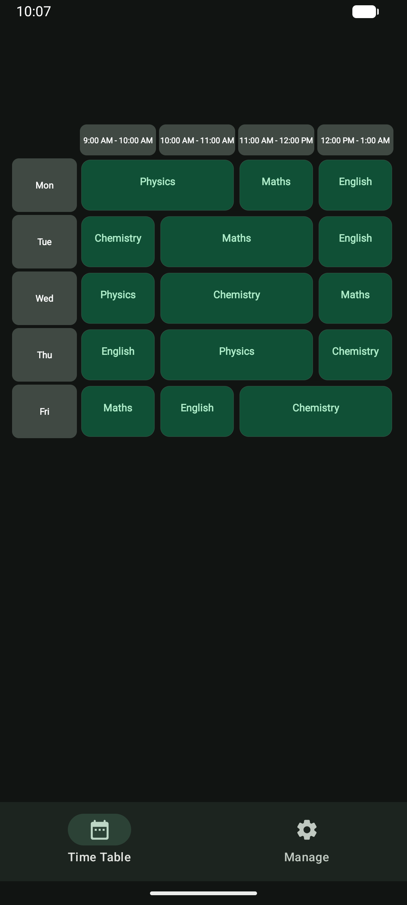
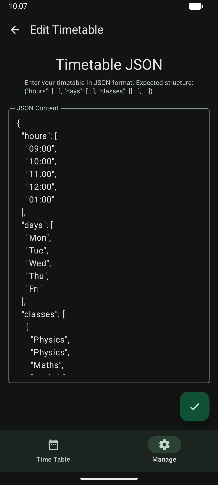
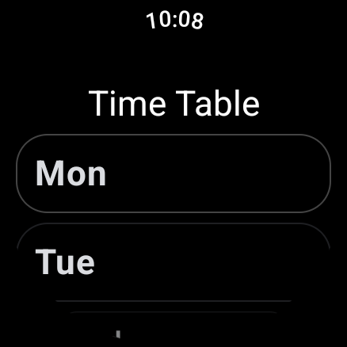
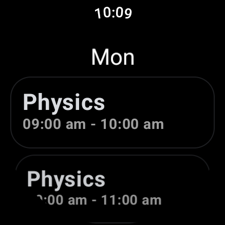
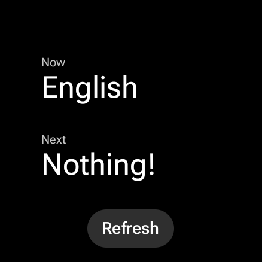

# Time Table

A native Android application for managing class schedules. Access your timetable on your phone or directly from your Wear OS device.

## Screenshots

### Phone
| Home | Edit |
|------|------|
|  |  |

### Wear OS
| Home | Day | Tile |
|------|----------|------|
|  |  |  |

## Features

### Phone
- View daily and weekly class schedules
- Native Android interface

### Wear OS
- Tile support for quick schedule access
- Optimized for small screens

## License

This project is licensed under the MIT License. See [LICENSE](LICENSE) for details.
